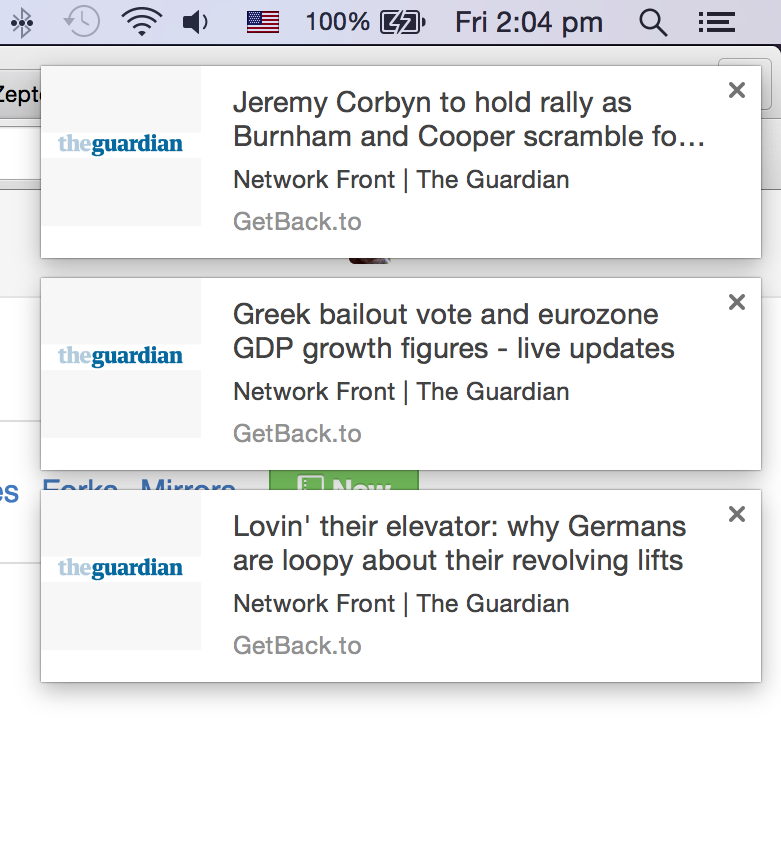

# GetBack

This is a Chrome extension. The extension shows whether or not a website has a RSS channel.
A user can subscribe on a channel and get notifications about updates instantly.
Click on the notification redirects a user to the news on a website. The extension supports Russian and English languages.

## Notifications

## Install

To install the extension visit <a href="https://chrome.google.com/webstore/detail/getbackto/ldhnpjfahcnimegheegmaioodmpmcldm?hl=en-US">Chrome Web Store<a/>

## Used frameworks and libraries:
<ul>
  <li><a href="http://knockoutjs.com/">Knockout</a></li>
  <li><a href="http://requirejs.org/">RequireJS</a></li>
  <li><a href="http://zeptojs.com/">Zepto</a></li>
</ul>
